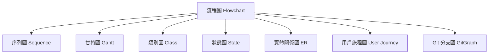
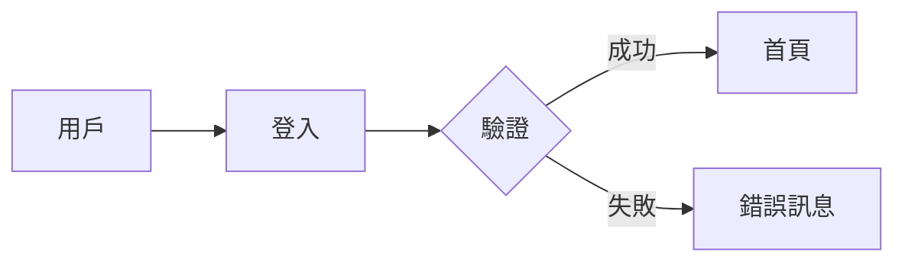
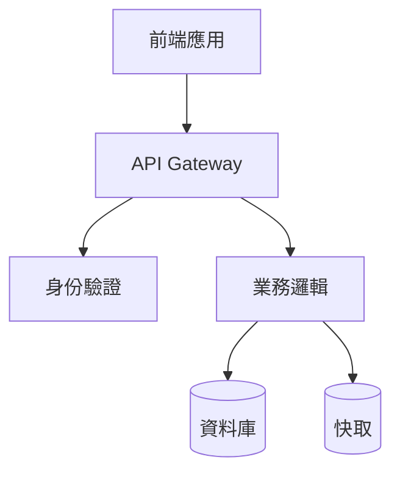
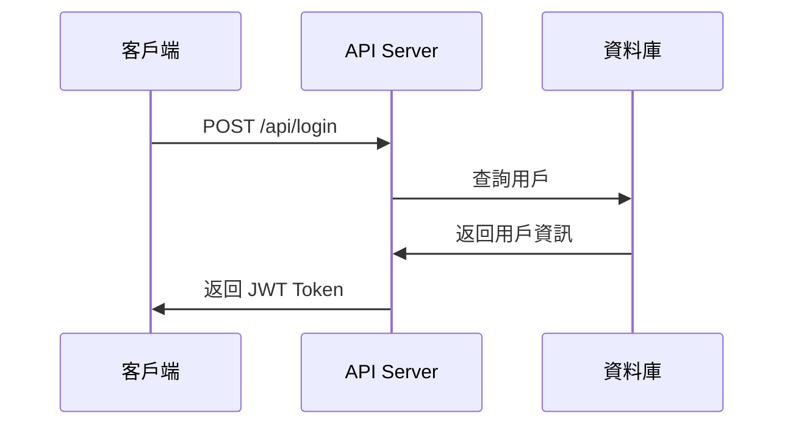

# 圖表與視覺化工具完全指南

## 🎯 為什麼需要圖表生成工具？

在AI輔助開發和知識管理的時代，將複雜的概念、流程、架構視覺化已成為必備技能。一張清晰的圖表勝過千言萬語，尤其在以下場景：

- **系統架構設計** - 展示微服務架構、數據流向
- **流程說明** - 業務流程、用戶旅程、決策樹
- **知識梳理** - 概念關係圖、思維導圖
- **文檔撰寫** - 技術文檔、API說明、使用手冊
- **團隊協作** - 會議記錄、計劃安排、專案管理

## 📊 主流圖表工具對比

### 🌊 Mermaid - 代碼驅動的圖表生成

**優勢**：
- ✅ 純文本格式，版本控制友好
- ✅ GitHub/GitLab 原生支援
- ✅ 語法簡潔，學習成本低
- ✅ 支援多種圖表類型
- ✅ 可嵌入 Markdown 文檔
- ✅ AI 友好（LLM 容易生成 Mermaid 語法）

**劣勢**：
- ❌ 自訂樣式選項有限
- ❌ 複雜圖表佈局控制困難
- ❌ 互動性功能較少

**適用場景**：
- 技術文檔中的流程圖、架構圖
- GitHub README 中的系統說明
- 快速原型設計和概念展示
- 與開發團隊的技術溝通

**支援的圖表類型**：


### 🎨 Draw.io (diagrams.net) - 全功能圖表編輯器

**優勢**：
- ✅ 豐富的模板和圖形庫
- ✅ 專業級的視覺效果
- ✅ 強大的佈局和對齊工具
- ✅ 支援多種匯出格式
- ✅ 免費且功能完整
- ✅ 可整合 Google Drive、OneDrive
- ✅ 協作功能完善

**劣勢**：
- ❌ 非文本格式，版本控制困難
- ❌ 學習曲線較陡峭
- ❌ 大型圖表載入速度較慢
- ❌ AI 難以直接生成

**適用場景**：
- 複雜系統架構圖
- 專業簡報和文檔
- UI/UX 設計稿
- 工程圖紙和技術規格

### 🧠 其他專業工具

#### **Lucidchart** - 企業級協作圖表
- **優勢**：企業級協作、豐富整合、專業模板
- **劣勢**：付費軟體、價格較高
- **適用**：大型企業、專業設計團隊

#### **Figma/FigJam** - 設計協作平台
- **優勢**：實時協作、UI 設計整合、互動性強
- **劣勢**：主要針對設計師、學習成本高
- **適用**：產品設計、用戶體驗設計

#### **PlantUML** - 程式碼生成UML
- **優勢**：純文本、UML標準、程式友好
- **劣勢**：語法複雜、視覺效果一般
- **適用**：軟體工程、系統分析

#### **Visio** - 微軟專業繪圖
- **優勢**：Microsoft 生態整合、企業標準
- **劣勢**：付費軟體、僅限 Windows
- **適用**：Windows 企業環境

## 🚀 Vibe Coding 時代的圖表策略

### 📝 文檔驅動開發 (Documentation-Driven Development)

**策略**：先畫圖，後寫碼
1. **需求分析階段**：使用 Mermaid 快速繪製業務流程圖
2. **系統設計階段**：用 Draw.io 設計詳細架構圖
3. **開發階段**：在程式碼註釋中嵌入 Mermaid 圖表
4. **測試階段**：繪製測試案例流程圖
5. **維護階段**：持續更新文檔中的圖表

### 🤖 AI 輔助圖表生成

**最佳實踐**：
- **用自然語言描述需求**：「我需要一個展示用戶註冊流程的圖表」
- **讓 AI 生成 Mermaid 代碼**：LLM 擅長生成結構化的圖表語法
- **迭代優化**：通過對話逐步完善圖表內容
- **混合使用工具**：簡單圖表用 Mermaid，複雜圖表用 Draw.io

### 🔄 圖表版本控制策略

**Mermaid 圖表**：
```markdown
<!-- 在 README.md 中直接嵌入 -->


**Draw.io 圖表**：
- 將 `.drawio` 檔案提交到版本控制
- 同時匯出 PNG/SVG 用於文檔展示
- 在 commit message 中說明圖表變更

## 📚 實戰應用案例

### 案例一：系統架構文檔

**場景**：為新專案撰寫技術文檔
**工具選擇**：Mermaid（概覽圖）+ Draw.io（詳細圖）



### 案例二：業務流程梳理

**場景**：梳理電商訂單處理流程
**工具選擇**：Draw.io（詳細業務流程）

**優化策略**：
1. 先用 Mermaid 快速建立基礎流程
2. 在 Draw.io 中完善細節和異常處理
3. 輸出多種格式供不同場合使用

### 案例三：API 文檔撰寫

**場景**：REST API 使用說明
**工具選擇**：Mermaid 序列圖



## 🎯 選擇指南與建議

### 🏃‍♂️ 快速原型 → Mermaid
- 需要快速展示想法
- 技術團隊內部溝通
- 文檔嵌入需求

### 🎨 精美展示 → Draw.io
- 客戶簡報
- 正式文檔
- 複雜系統架構

### 👥 團隊協作 → Figma/Lucidchart
- 多人同時編輯
- 設計評審
- 企業級專案

### 📊 數據視覺化 → 專業工具
- D3.js（網頁互動圖表）
- Tableau（商業智能）
- Python matplotlib/seaborn（數據分析）

## 💡 未來趋势與展望

### 🤖 AI 驅動的智能圖表
- **自然語言生成圖表**：描述需求直接產生圖表
- **智能佈局優化**：AI 自動調整最佳視覺效果
- **內容理解與建議**：分析文檔內容自動建議圖表類型

### 🔗 無縫整合與協作
- **即時協作編輯**：多人即時修改與評論
- **版本控制整合**：與 Git 工作流完美結合
- **跨平台同步**：雲端儲存與跨設備存取

### 🎭 互動與沈浸體驗
- **互動式圖表**：可點擊、展開的動態內容
- **VR/AR 視覺化**：三維空間中的系統架構展示
- **智能問答**：與圖表內容進行對話式互動

## 🔧 實用資源與工具

### 線上工具
- **Mermaid Live Editor**: https://mermaid.live/
- **Draw.io**: https://app.diagrams.net/
- **PlantUML Online**: http://www.plantuml.com/plantuml/

### 瀏覽器插件與擴展
- **Mermaid Preview** (VS Code)
- **Draw.io Integration** (Confluence)
- **Diagrams.net Desktop** (離線版本)

### 學習資源
- **Mermaid 官方文檔**: https://mermaid-js.github.io/mermaid/
- **Draw.io 教學影片**: YouTube 搜尋 "draw.io tutorial"
- **圖表設計最佳實踐**: Edward Tufte 的視覺化理論

透過合理選擇和搭配使用這些圖表工具，可以大幅提升在 Vibe Coding 時代的溝通效率和文檔品質！